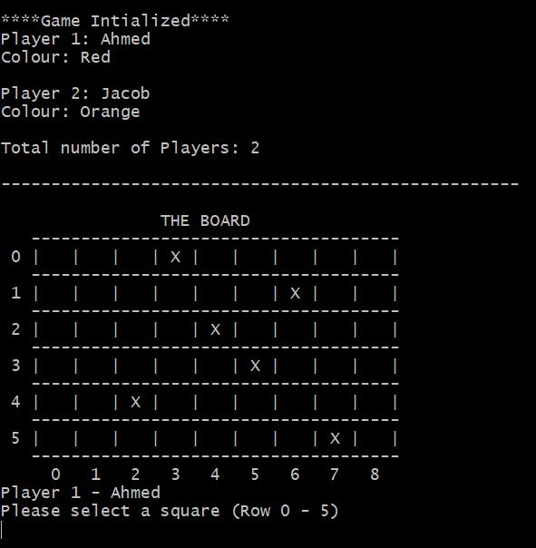

# Igel Ärgern Board Game
**Software Engineering Project 1: Assignment 2, UCD BSc. Computer Science 1st Year**  
This is a C implementation of the German Board game, *Igel Ärgern*, which translates to "Hedgehogs in a Hurry". This was completed in a team of two over roughly five sprints.

## Getting Started
1. Download the repository as a zipped folder.
2. Unzip the repository.
3. Compile the following 3 files using this command: **gcc main1.c game_init.c game_logic.c**  
4. Run the executable: **./a**

## The Game

- The game can be played by 2 to 6 players each having *four* tokens.
- Tokens move left to right and tokens sharing the same square are stacked. Only the token on the top can move.
- At each turn the dice is rolled, the player is given the choice of moving his/her tokens up or down then a token in the row of the number rolled will be moved at the end of the turn.
- Tokens that land at an (X) obstacle are stuck in it until all other tokens on the board catch up to the same column.
- The winner is the first person to get *three* of their tokens in the last column of the board.

## Contents
- **main1.c:** Contains the driver code for the game.
- **game_init.c:** Contains the initializing code for the game such as setting up the board.
- **game_logic.c:** Contains the logical aspects of the code such as checking for winner.

## Authors
- Ahmed Jouda
- Jacob Whelan
